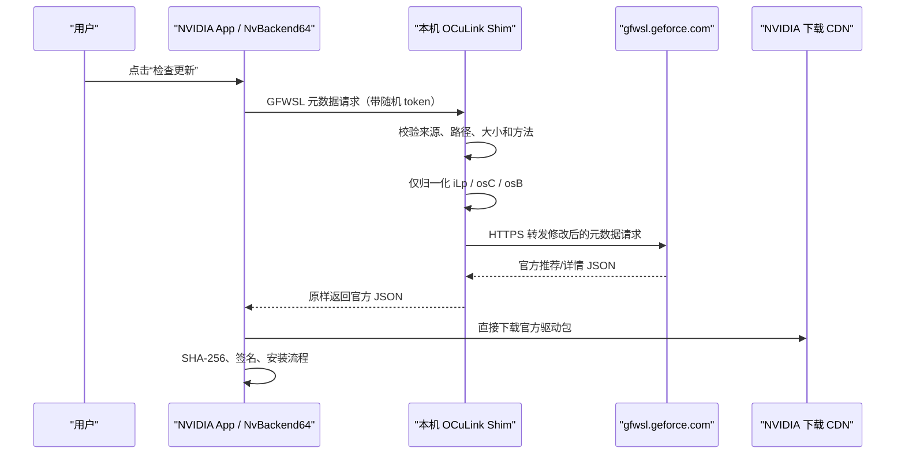

# 工作流原理

## 根因

OCuLink 把桌面 NVIDIA 显卡以 PCIe 设备形式接到笔记本。显卡设备 ID 是桌面卡，
但 NVIDIA App 仍按主机形态上报 `iLp=1`（laptop），并在当前 Win11 预览版上报
过于具体的 `osC=10.0.26200`。NVIDIA 官方 GFWSL 元数据接口对这组条件没有返回
候选驱动。

同一个请求保持显卡 ID、当前驱动版本和分支不变，只将：

- `iLp` 从 `1` 改为 `0`；
- `osC` 从 `10.0.26200` 归一化为 `10.0`；
- `osB` 同步为 `26200`；

官方接口就会返回该桌面 GPU 对应的正式驱动。这里修复的是错误分类，不是伪造
设备 ID，也不是绕过 NVIDIA 驱动兼容性检查。

## 一次“检查更新”如何流动

Shim 不接触图形驱动包。下载 URL 指向 NVIDIA CDN，下载、签名校验、安装以及失败
回滚仍由 NVIDIA App 自己完成。

## 为什么要改两处 NVIDIA 配置

NVIDIA App 内部有两条读取 GFWSL 地址的路径：

1. `component_profiles.json` 中 `grd` / `crd` 的 `otaBaseUrl`，供更新框架使用；
2. `LocalizedConfig.json` 中 `localizedConfig.gfwsl.server`，供
   `NvBackend64.dll` 驱动的可见“检查更新”流程使用。

只改第一处时，部分后台更新请求能走 shim，但 UI 刷新按钮仍绕开它。因此 v3
同时重定向这两处。

## 为什么必须占用 127.0.0.1:80

NVIDIA 的 URL 解析链对显式 loopback 端口存在兼容问题。例如
`http://127.0.0.1:17886/...` 中的 `:17886` 被保留在传给 WinHTTP 的 server
name 中，`WinHttpOpenRequest` 在发包前就以 12005 失败。

使用 `http://127.0.0.1/<token>/...` 可避开该问题，所以目前需要 HTTP 默认端口
80。监听地址严格绑定 `127.0.0.1`，不会监听局域网网卡；随机 token 用于减少网页
请求误入和 CSRF 风险，但不被当作抵御同一 Windows 用户下恶意原生进程的安全边界。

## 浏览器安全限制

NVIDIA App 的 UI 来源是 `https://nvfile`。它访问 loopback HTTP 时会触发 CORS
和 Private Network Access 预检。Shim 只允许这个精确 Origin，支持 credentialed
CORS/PNA，并拒绝其他浏览器来源；没有 Origin 的原生 backend 请求仍可通过。

## 当前最脆弱的环节

`NvLocalizedConfig` 会定期从 NVIDIA 刷新本地配置并覆盖 loopback 地址。v3 将根
`configTimestamp` 延后一年，暂时阻止覆盖，同时保留其余缓存内容。卸载时会恢复
原时间戳。

这是经过现场验证的兼容手段，但不是理想的长期产品机制：NVIDIA App 升级、重装
或缓存结构变化都可能使重定向失效。因此产品版必须检测配置 schema 和哈希变化，
提示用户进行一次带 UAC 的“修复”，而不能让常驻低权限服务偷偷获得写权限。
